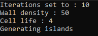
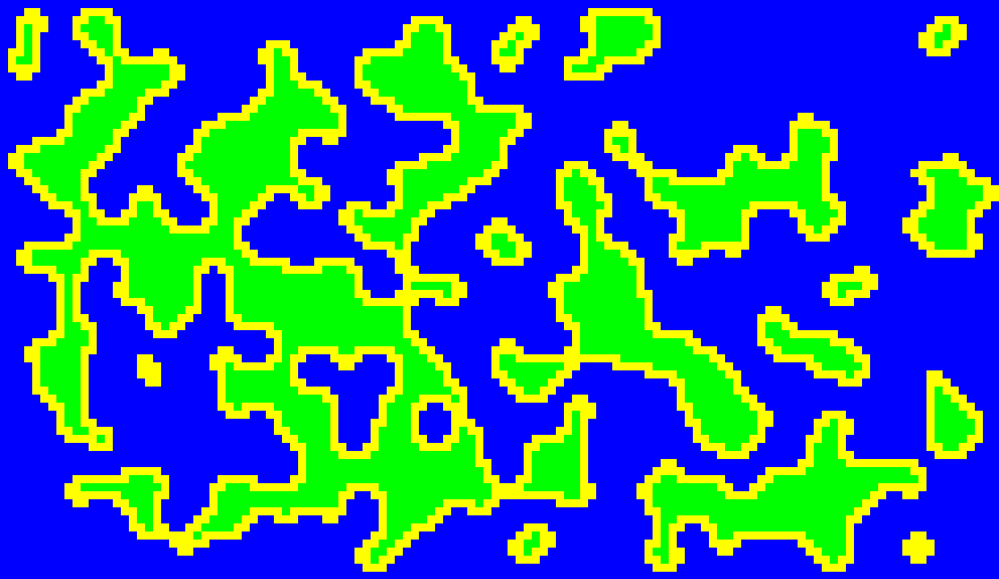
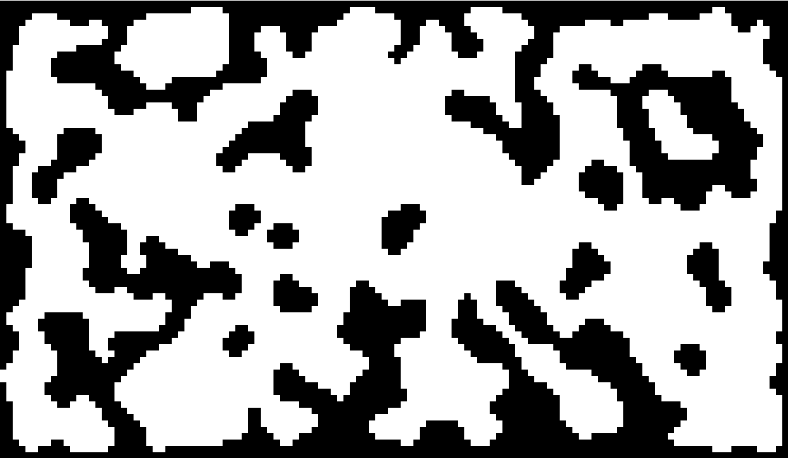

# Cellular Automata for world generation

This project is mostly me messing around with Cellular Automata to procedurally generate land and caves.

Using a variety of settings u can get interesting designs:

Islands:

Caves:

# Compiling
Get SFML, import the project on visual studio and compile it.
